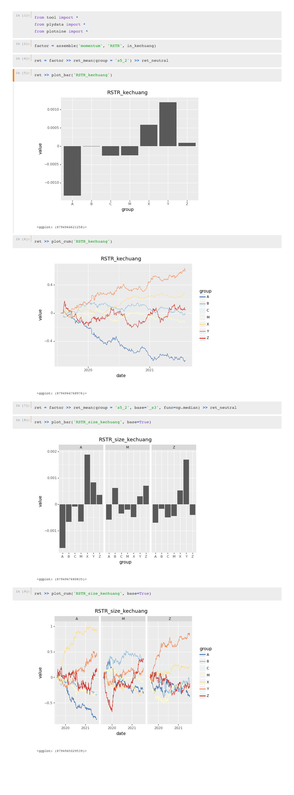

# 量化数据系统

本项目采用一个统一的模型，可以从不同的数据来源（如tushare、akshare、opendata、集思录等）采集数据。将这些数据按照 Arrow 格式层次化地保存在本地，并提供单因子分析工具。

## 数据描述与更新

数据通过 Dataset 描述
- DailyDataset 增量更新
- DailyRefresh 全量刷新
- DailyUpdate 比较主键，进行覆盖刷新

```python
class TushareFundNav(DailyDataset, TushareMixin):
    """获取公募基金净值数据"""
    # 类的注释会变成库表的注释

    # 数据库表名
    name = "tushare-fund_nav"
    # 数据开始的时间
    schedule_start_date = '2000-01-01'
    # 使用的市场日历，以确定市场开放的时间
    schedule_market = "SSE"
    # 数据更新时间
    schedule_time = time(9, 30)
    # 数据更新时间 的 间隔天数
    schedule_delay = timedelta(days=0)

    # 表属性的描述
    columns = [
        Column("ts_code", String, primary_key=True),
        Column("trade_date", Date, comment="公告日期"),

        Column("nav_date", Date, comment="净值日期", primary_key=True),
        Column("unit_nav", Float, comment="单位净值"),
        Column("accum_nav", Float, comment="累计净值"),
        Column("accum_div", Float, comment="累计分红"),
        Column("net_asset", Float, comment="资产净值"),
        Column("total_netasset", Float, comment="合计资产净值"),
        Column("adj_nav", Float, comment="复权单位净值"),
        Column("update_flag", String, comment="更新标识，0未修改1更正过")
    ]

    # 定义数据的获取方式
    def fetch(self):
        data = self.api.fund_nav(nav_date=self.ts_date)

        data = data.sort_values('ann_date').drop_duplicates(["ts_code", "nav_date"], keep='last')

        data = data.rename(columns=dict(ann_date = 'trade_date'))

        return data
```

描述的格式会通过 metaclass 注册到系统

通过`python sync.py`，获取数据

## 本地存储

通过远程数据库`postgres`，在本地通过 `Arrow` 格式备份，以进行快速的分析

`python backup.py`，备份数据
`python clean.py`，清洗数据并对齐时间
## 备份

通过 toml 格式来管理更新的元数据，并提供以下备份方式：

- Backup 全备份
- BackupIncr 增量备份

### 本地 Arrow 层
+ Backup：备份层，以时间作为 partition，从数据库备份中获取数据
+ Clean：清洁层，对缺失值进行填补、异常值进行修正
+ Feature：特征层，在时间序列上构造因子之前进行前处理
+ Factor：因子层，在截面上创建因子由于因子需要时间对齐，所以在这一层存在截面的概念。截面范围记录在 axis 中
+ Portfolio：组合相关层，利用时间上的特征进行组合分析
+ Target：标的层，包括时间上不变的特征

## 分析

提供了一系列函数，可以在 tool 路径下找到，以方便进行单因子分析

[plydata](https://plydata.readthedocs.io/en/stable/)
[plotnine](https://plotnine.readthedocs.io/en/stable/)


